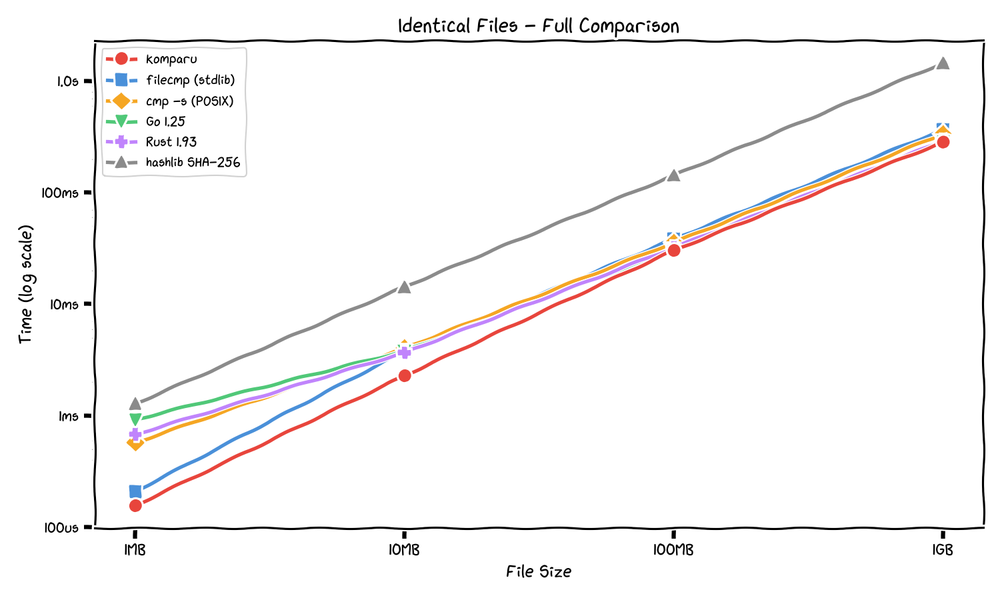
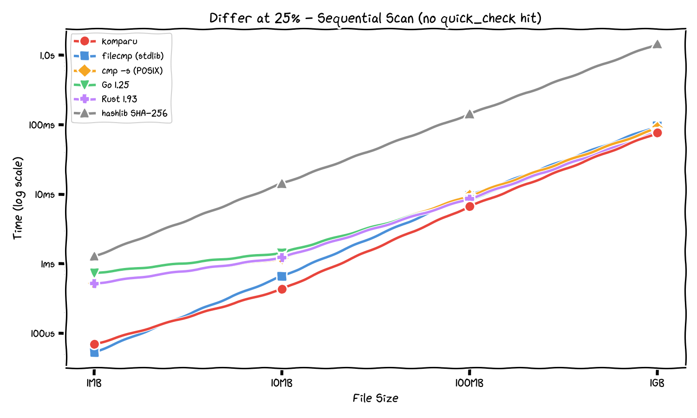
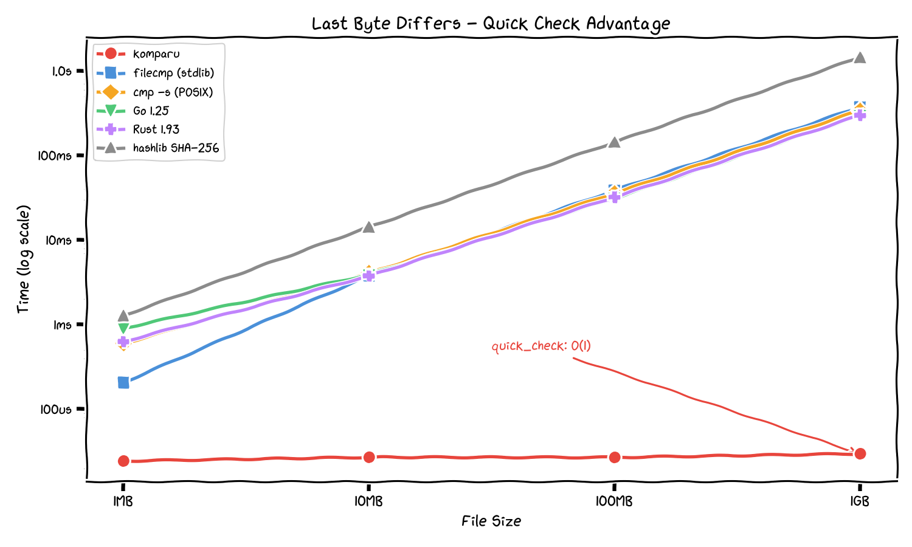
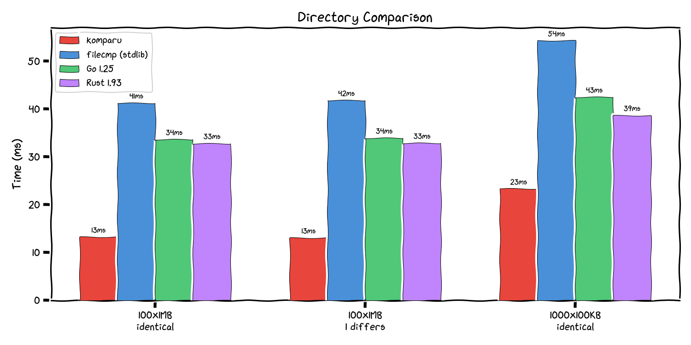
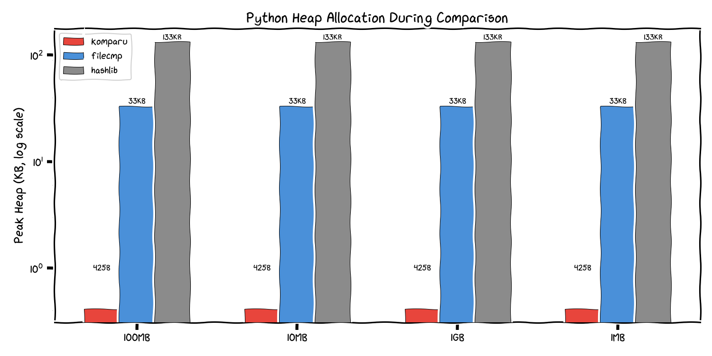
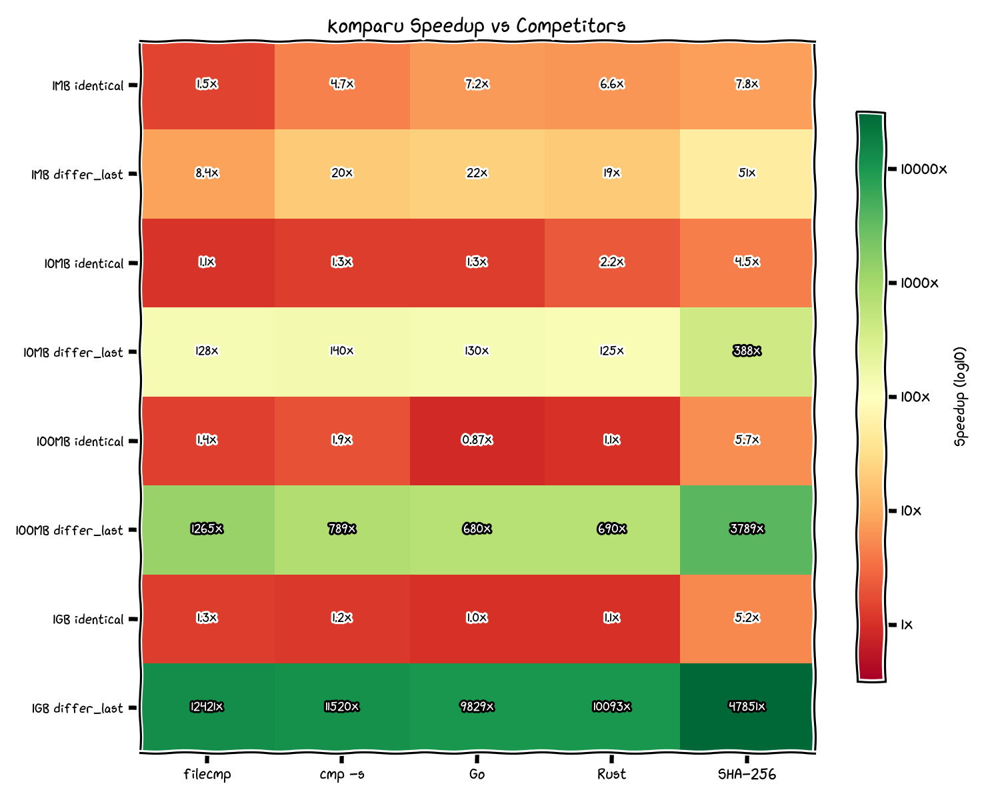

**English** | [Русский](README.ru.md)

# komparu

Ultra-fast file comparison library with a C23 core. Compares local files, directories, archives, and HTTP resources byte-by-byte using memory-mapped I/O, vectorized operations, and a native thread pool.

## Features

- **mmap + MADV_SEQUENTIAL** — zero-copy reads with kernel readahead hints
- **Quick check** — samples first/last/middle bytes before full scan (catches most differences in O(1))
- **Size precheck** — skips content comparison when file sizes differ
- **Parallel directory comparison** — native pthread pool, configurable worker count
- **Archive comparison** — entry-by-entry comparison of tar/zip/gz/bz2/xz via libarchive
- **HTTP comparison** — compare local files against remote URLs via libcurl
- **Async API** — `komparu.aio` with C thread pool + eventfd, zero `asyncio.to_thread()` overhead
- **Archive bomb protection** — configurable size/ratio/entry limits

## Installation

```bash
pip install komparu
```

From source (requires clang, cmake, libcurl, libarchive):

```bash
CC=clang CMAKE_ARGS="-DCMAKE_C_COMPILER=clang" pip install -e .
```

## Quick Start

```python
import komparu

# Compare two files
equal = komparu.compare("file_a.bin", "file_b.bin")

# Compare directories
result = komparu.compare_dir("/dir_a", "/dir_b")
print(result.equal, result.diff, result.only_left, result.only_right)

# Compare archives
result = komparu.compare_archive("a.tar.gz", "b.tar.gz")

# Compare file against URL
equal = komparu.compare("local.bin", "https://example.com/remote.bin")

# Compare local directory against URL mapping
result = komparu.compare_dir_urls("/local/dir", {
    "file1.txt": "https://cdn.example.com/file1.txt",
    "file2.txt": "https://cdn.example.com/file2.txt",
})

# Check if all sources are identical
all_same = komparu.compare_all(["file1", "file2", "file3"])

# Detailed pairwise comparison
result = komparu.compare_many(["file1", "file2", "file3"])
print(result.all_equal, result.groups, result.diff)
```

## Async API

```python
import komparu.aio

# All functions mirror the sync API
equal = await komparu.aio.compare("file_a", "file_b")
result = await komparu.aio.compare_dir("/dir_a", "/dir_b")
result = await komparu.aio.compare_archive("a.tar.gz", "b.tar.gz")
all_same = await komparu.aio.compare_all(["f1", "f2", "f3"])
result = await komparu.aio.compare_many(["f1", "f2", "f3"])
result = await komparu.aio.compare_dir_urls("/dir", url_map)
```

The async API uses C threads + eventfd/pipe integrated with `asyncio.loop.add_reader()`. No Python threads, no GIL contention, no stack overhead.

## Configuration

```python
komparu.configure(
    chunk_size=65536,          # bytes per read (default: 64KB)
    size_precheck=True,        # compare sizes first
    quick_check=True,          # sample first/last/middle bytes
    max_workers=0,             # thread pool size (0 = auto)
    timeout=30.0,              # HTTP timeout in seconds
    follow_redirects=True,     # follow HTTP redirects
    verify_ssl=True,           # verify SSL certificates
    headers={"Authorization": "Bearer ..."},  # HTTP headers
)
```

## Types

```python
from komparu import DirResult, CompareResult, DiffReason, Source

# DirResult — returned by compare_dir, compare_archive, compare_dir_urls
result.equal         # bool
result.diff          # dict[str, DiffReason] — relative paths that differ
result.only_left     # set[str] — files only in first source
result.only_right    # set[str] — files only in second source

# DiffReason — why files differ
DiffReason.CONTENT_MISMATCH
DiffReason.SIZE_MISMATCH
DiffReason.MISSING
DiffReason.TYPE_MISMATCH
DiffReason.READ_ERROR

# CompareResult — returned by compare_many
result.all_equal     # bool
result.groups        # list[set[str]] — groups of identical sources
result.diff          # dict[tuple[str, str], bool] — pairwise results

# Source — for per-source HTTP settings
source = Source(url="https://...", headers={...}, timeout=10.0)
komparu.compare(source, "local.bin")
```

## Benchmarks

All benchmarks on tmpfs (/dev/shm) with page cache warmed. 20 samples per benchmark, auto-calibrated loop count. Competitors: Python `filecmp` (stdlib), `hashlib` SHA-256, POSIX `cmp -s`, GNU `diff -q`, Go 1.25, Rust 1.93. Source code and raw results in [`benchmarks/`](benchmarks/).

### File Comparison: Identical Files

<p align="center">
  
</p>

komparu is consistently at the bottom (fastest). For identical files it is **1.3x faster** than filecmp (Python stdlib) and competitive with native Go/Rust implementations.

### File Comparison: Differ at 25% (Honest Sequential Scan)

<p align="center">
  
</p>

The fairest comparison: difference at 25% of the file, a position **quick_check does NOT sample**. komparu must do a real sequential mmap+memcmp scan here, showing its raw I/O advantage without any shortcuts.

### File Comparison: Last Byte Differs (Quick Check)

<p align="center">
  
</p>

komparu's **quick_check** samples first/last/middle bytes before scanning. This catches differ-at-end instantly (**30us for 1GB**) while all competitors must read the entire file. The flat red line is O(1) regardless of file size.

### Directory Comparison

<p align="center">
  
</p>

komparu's native thread pool gives **2-3x** speedup over filecmp and outperforms Go/Rust implementations across all directory scenarios.

### Memory Usage

<p align="center">
  
</p>

komparu allocates just **425 bytes** of Python heap regardless of file size (mmap pages are managed by the kernel). filecmp needs 33KB (8KB buffers x2), hashlib needs 133KB (SHA-256 context + buffer). Note: `filecmp shallow=True` only checks file stat, not content.

### Multi-Dimensional Comparison

<p align="center">
  
</p>

### Speedup Heatmap

<p align="center">
  
</p>

Green = komparu faster. Dark green cells in `differ_last` rows show quick_check advantage. Compare with `differ_quarter` rows for honest sequential performance.

<details>
<summary>Raw numbers (median time)</summary>

**File Comparison**

| Scenario | Size | komparu | filecmp | cmp -s | Go | Rust |
|----------|------|---------|---------|--------|----|------|
| identical | 1MB | 157us | 210us | 575us | 926us | 683us |
| identical | 10MB | 2.29ms | 3.80ms | 4.05ms | 3.81ms | 3.69ms |
| identical | 100MB | 30ms | 38ms | 36ms | 31ms | 32ms |
| identical | 1GB | 284ms | 368ms | 336ms | 288ms | 291ms |
| differ_quarter | 1MB | 70us | 54us | 526us | 742us | 521us |
| differ_quarter | 10MB | 432us | 663us | 1.20ms | 1.44ms | 1.23ms |
| differ_quarter | 100MB | 6.7ms | 9.6ms | 9.5ms | 8.4ms | 8.7ms |
| differ_quarter | 1GB | 77ms | 96ms | 89ms | 77ms | 78ms |
| differ_last | 1MB | 25us | 206us | 598us | 907us | 631us |
| differ_last | 10MB | 27us | 3.79ms | 4.08ms | 3.91ms | 3.78ms |
| differ_last | 100MB | 27us | 39ms | 36ms | 31ms | 32ms |
| differ_last | 1GB | 30us | 375ms | 342ms | 295ms | 299ms |

**Directory Comparison**

| Scenario | komparu | filecmp | Go | Rust |
|----------|---------|---------|-----|------|
| 100 files x 1MB, identical | 13ms | 41ms | 34ms | 33ms |
| 100 files x 1MB, 1 differs | 13ms | 42ms | 34ms | 33ms |
| 1000 files x 100KB, identical | 23ms | 54ms | 43ms | 39ms |

**Memory (Python heap allocation)**

| Size | komparu | filecmp (deep) | filecmp (shallow) | hashlib SHA-256 |
|------|---------|----------------|-------------------|-----------------|
| 1MB-1GB | 425 B | 33.2 KB | 835 B | 133.3 KB |

</details>

### Reproduce

```bash
cd benchmarks/competitors && make all && cd ..
python run_all.py --fast   # ~5 min quick run
python run_all.py          # ~30 min full suite
```

See [`benchmarks/README.md`](benchmarks/README.md) for methodology details.

## Documentation

- [API Reference](docs/en/api.md)
- [Architecture](docs/en/architecture.md)
- [Requirements](docs/en/requirements.md)
- [Security](docs/en/security.md)
- [Edge Cases](docs/en/edge-cases.md)

## Architecture

C23 core with Python bindings via CPython C API:

- **mmap** with `MADV_SEQUENTIAL` for optimal readahead
- **pthread pool** for parallel directory/multi-file comparison
- **eventfd** (Linux) / **pipe** (macOS) for async notification
- **libcurl** for HTTP with connection pooling
- **libarchive** for archive format support
- **CAS-based task lifecycle** for safe async cancellation

## License

MIT
